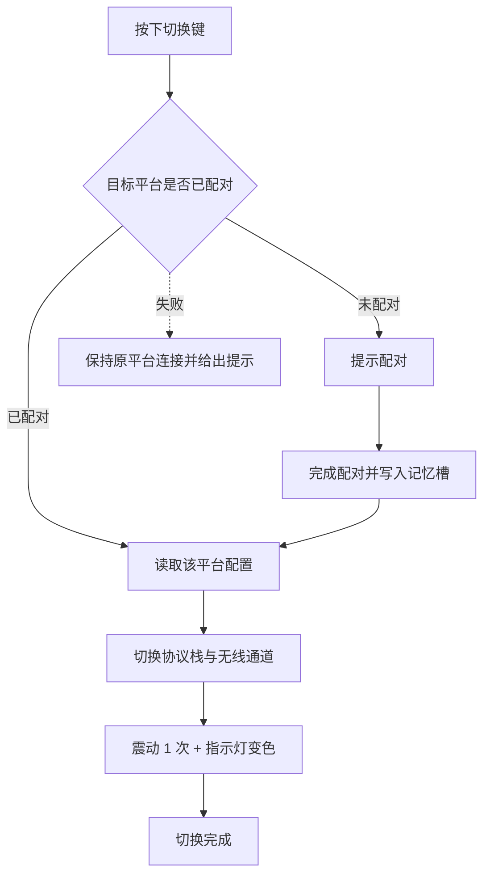
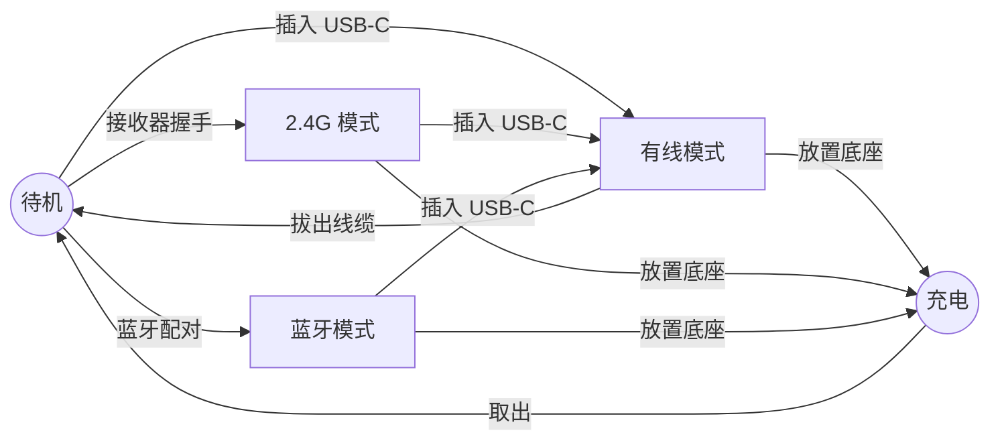

# 产品需求文档

版本：v2 ｜ 更新日期：2026-09-22 ｜ 读者：研发、供应链、测试

## 变更记录

| 版本 | 日期 | 变更内容 | 原因 |
| --- | --- | --- | --- |
| v2 | 2026-09-22 | 由 13 节压缩为 6 节；定价、竞品、风险、验证计划四处改为交叉引用；新增平台切换流程图与连接状态机；优先级统一为 P0/P1/P2；可用性通过线统一为 8/10；新增本变更记录表 | 原版与 `单位经济模型.md`、`竞品分析.md`、`路线图.md` 大量重复；研发侧需要表格与流程图，不需要长段落 |
| v1 | 2026-09-22 | 初版 | — |

## 0. 文档约定

| 项目 | 内容 |
| --- | --- |
| 本文件负责 | 功能需求、硬件规格、认证要求、交互规则、验收标准 |
| 本文件不负责 | 定价与成本见 `单位经济模型.md`；竞品见 `01-竞品分析/竞品分析.md`；排期与决策点见 `路线图.md`；评审材料见 `评审摘要.md` |
| 数据性质 | 规格与故障模式来自竞品实证（E 系列）；定价与人群来自预测数据（PE 系列），非真实调研 |
| 缺失处理 | 拿不到的数据一律写「未获取」，不用估算填充 |

优先级定义：

| 级别 | 含义 | 判定 |
| --- | --- | --- |
| P0 | 必须做 | 不做不能上市，缺失即为阻断项 |
| P1 | 应该做 | 首批必须有，可比 P0 晚一个节点交付 |
| P2 | 可以做 | 后续版本，不影响首发验收 |

## 1. 定位与范围

**一句话：** 给每天在不同平台之间切换的玩家，做一支按一下换平台、不需要重新配对的手柄。

目标用户：22–30 岁多平台玩家，每天至少切换一次平台（预测占目标人群 44.3%，PE08）。

| 范围 | 内容 |
| --- | --- |
| 做 | 一键切换、配对记忆、2.4G 稳定性、按键与摇杆耐久、三模连接、充电底座、磁吸键帽 |
| 不做 | AI 语音（ADR-005）、自研按键符号自动切换（ADR-009）、把键帽当卖点、云端配置同步 |
| 本文件不承诺 | 价格、销量、上市时间 |

首发 SKU：

| SKU | 平台范围 | 硬件形态 |
| --- | --- | --- |
| 通用三模 | PC、Android、iOS 蓝牙、Switch | 共用主板 |
| PS 授权 | 通用 + PS5 | 独立 SKU（ADR-003） |
| Xbox 授权 | 通用 + Xbox | 独立 SKU（ADR-003） |
| Lightning MFI | 通用 + iPhone 14 及以下 | 独立 SKU（ADR-004） |

## 2. 核心场景

| 编号 | 场景 | 现状痛点 | 验收方式 |
| --- | --- | --- | --- |
| S01 | Switch 换到 PC 继续玩 | 竞品需长按 HOME 进菜单选模式再配对（E008） | 切换 ≤3 秒，免重新配对 |
| S02 | 手机换回 PC | 重新配对、重新改键 | 掉电 24 小时后仍免重新配对 |
| S03 | 2.4G 联机连续数小时 | 竞品出现需恢复出厂设置的重连故障（E015、E016） | 3 台样机各连续 4 小时 0 断连 |
| S04 | 长期高频使用 12–24 个月 | 竞品 A 键断触为长期通病（E011、E012） | 见 F04、F05 |
| S05 | 多平台改键与宏 | 改键软件为八项痛点中的最低分项（PE06） | 一次配置全平台生效 |

### 2.1 平台切换流程

硬要求：全流程 ≤3 秒，且不进入设置菜单。

## 3. 功能需求

### 3.1 P0 必须做

| 编号 | 需求 | 验收标准 | 状态 |
| --- | --- | --- | --- |
| F01 | 一键切换 | 10 人中 ≥8 人首次成功；切换 ≤3 秒 | 待可用性测试 |
| F02 | 配对记忆 | 记住 ≥4 个平台，掉电 24 小时后保留 | 提案待确认 |
| F03 | 2.4G 连接稳定 | 3 台样机各连续 4 小时，0 次断连 | 提案待确认 |
| F04 | ABXY 按键耐久 | 耐久测试后接触阻抗与行程变化在阈值内 | 阈值待代工厂确认 |
| F05 | 摇杆耐久 | 12 个月内无可感知漂移 | 阈值待代工厂确认 |
| F06 | 摇杆方案 | 霍尔或 TMR，不使用碳膜 | 待选型（P13） |
| F07 | 三模连接 | 有线 / 2.4G / 蓝牙在目标平台均可识别 | 范围已确认 |
| F08 | 充电底座标配 | 落座即充电，无需插线 | 已含在 BOM |
| F09 | 磁吸键帽 | Switch 与 Xbox 布局徒手互换，装回无松动 | 已冻结（ADR-009） |
| F10 | PS / Xbox 独立 SKU | 各自通过授权方认证 | 已定（ADR-003） |
| F11 | Lightning MFI SKU | 通过 MFI 认证 | 已定（ADR-004） |

### 3.2 P1 应该做

| 编号 | 需求 | 验收标准 | 依据 |
| --- | --- | --- | --- |
| F12 | 4 个可自定义背键 | 每个可独立映射，配置保存 4 套 | E001 |
| F13 | 陀螺仪 | Switch 与 PC 可用 | 项目简报 2.2 |
| F14 | 改键与宏 | PC 工具与 App 配置一致 | PE06 |
| F15 | 可调扳机键程 | ≥3 档，切换后手感可复现 | E002 |
| F16 | 低电量提示 | 低于阈值时震动提示并在 App 显示 | — |
| F17 | 售后首响 ≤48 小时 | 首响时长可统计 | E015 |

### 3.3 P2 可以做

| 编号 | 需求 | 依据 |
| --- | --- | --- |
| F18 | 屏幕显示连接状态与电量 | E009 |
| F19 | 触控板（仅 PS SKU） | E001 |
| F20 | 可更换摇杆模块 | E001 |

### 3.4 不做

| 需求 | 原因 |
| --- | --- |
| AI 语音 | ADR-005 |
| 自研按键符号自动切换 | ADR-009 |
| 把键帽布局当作卖点 | 预测数据中仅 6.0% 的人选它（PE04） |
| 云端配置同步 | 减少账号体系与隐私合规范围 |

> 问卷 E1（功能取舍）、E2（不希望首发搭载）、F2（PS5 功能依赖）三题未纳入预测数据，P1 与 P2 的排序仅依据竞品证据，属待验证判断。

## 4. 硬件规格与认证

| 项目 | 目标值 | 下限 | 上限 | 验证方式 | 状态 |
| --- | --- | --- | --- | --- | --- |
| 重量 | ≤250 g | — | 250 g | 电子秤 | 依据 PE11 |
| 无线延迟（2.4G，PC，1000 Hz） | ≤8 ms | — | 8 ms | 专业延迟测试 | 提案待确认 |
| 蓝牙延迟 | 未获取 | — | — | — | 待实测 |
| 续航（2.4G，关灯效与震动） | ≥20 h | 20 h | — | 实测 | 提案待确认 |
| 摇杆 | 霍尔或 TMR | — | — | 选型评审 | 待定（P13） |
| 扳机 | 霍尔效应，可调键程 | — | — | 选型评审 | 提案待确认 |
| 按键寿命 | 未获取 | — | — | 代工厂标准 | 待确认口径 |
| 电池容量 | 未获取 | — | — | — | 待选型 |
| 充电接口 | USB-C | — | — | 充电实测 | 已确认 |

认证矩阵：

| 项目 | 要求 | 周期 | 成本 |
| --- | --- | --- | --- |
| SRRC | 待确认是否为国内首发硬门槛 | 未获取 | 未获取 |
| FCC / CE | 待确认国内首发是否需要 | 未获取 | 未获取 |
| BQB | 待确认 | 未获取 | 未获取 |
| MFI | SKU-D 必需 | 未获取 | 未获取 |
| PS 授权 | 已生效；覆盖范围待确认（P02、P03） | 未获取 | 未获取 |
| Xbox 授权 | 已生效；覆盖范围待确认（P02、P03） | 未获取 | 未获取 |

## 5. 交互与软件

### 5.1 连接状态机

### 5.2 交互规则

| 项目 | 规则 | 状态 |
| --- | --- | --- |
| 平台切换 | 单次按键触发，不走长按进菜单路径 | 待可用性测试 |
| 切换反馈 | 震动 1 次 + 指示灯按平台变色 | 提案 |
| 按键符号 | 仅通过物理磁吸键帽更换，不承诺自动变化 | 已冻结（ADR-009） |
| 改键与宏 | PC 工具与 App 共用同一配置文件 | 提案 |
| 低电量提示 | 震动 1 次 + 指示灯闪烁 + App 推送 | 提案 |

### 5.3 软件配套

| 项目 | 范围 |
| --- | --- |
| PC 配置工具 | Windows 10/11、macOS 12+ |
| 手机 App | Android 8.0+、iOS 16.3+ |
| 固件更新 | 通过 App 或 PC 工具 |
| 配置文件 | 本地保存，支持导入导出 |
| 云端同步 | 不做 |

## 6. 验收与验证

验收汇总：

| 类别 | 通过标准 | 责任岗位 |
| --- | --- | --- |
| 交互 | 8/10 人首次成功，切换 ≤3 秒 | UI/UX |
| 连接 | 4 小时 0 断连 | 电子与固件、测试与品控 |
| 耐久 | 达到 F04、F05 的阈值 | 测试与品控 |
| 认证 | 首发所需认证全部取证 | 供应链与采购 |

验证计划：

| 阶段 | 验证什么 | 方法 | 通过标准 |
| --- | --- | --- | --- |
| 纸原型 | 切换是否直观 | 可用性测试 8–10 人 | 8/10 首次成功 |
| 选型评审 | 霍尔与 TMR 的成本与功耗 | 报价加样机实测 | 满足 BOM 与续航目标 |
| EVT | 延迟与续航 | 实测 | 达到第 4 节目标值 |
| DVT | 按键与摇杆耐久 | 耐久测试 | 达到 F04、F05 阈值 |
| PVT | 手感与故障率 | 内测用户 | 好评率 ≥85% |

未决项（影响规格冻结）：

| 编号 | 事项 | 需要谁提供 |
| --- | --- | --- |
| P13 | 摇杆选霍尔还是 TMR | 方案商与代工厂报价 |
| H05 | 授权 SKU 的额外成本是否在 330 元内 | 授权协议与方案商 |
| P01 | Switch 是否进首发 | 项目方 |
| P12 | 四个 SKU 的模具、认证费用与 MOQ | 代工厂报价 |

## 7. 来源

[PE01]–[PE12] 预测数据证据，见 `02-需求调研/调研分析-预测版.md` 第 13 节 - 程序生成 - 2026-09-22
[E001] Sony DualSense Edge 产品页 - https://www.playstation.com/en-us/accessories/dualsense-edge-wireless-controller/ - 2026-09-22
[E002] Xbox Elite Series 2 产品页 - https://www.xbox.com/en-US/accessories/controllers/elite-wireless-controller-series-2 - 2026-09-22
[E004] 8BitDo Ultimate 2 产品页 - https://www.8bitdo.com/ultimate-2-wireless-controller/ - 2026-09-22
[E008] 飞智帮助中心 Switch 连接教程 - https://help.flydigi.com/ - 2026-09-22
[E009] 知乎 北通鲲鹏50二代使用体验 - https://zhuanlan.zhihu.com/ - 2026-09-22
[E011] 百度贴吧 Xbox精英二代A键问题解决方案 - https://tieba.baidu.com/p/8462834365 - 2026-09-22
[E012] B站 Xbox精英二代A键断触修复 - https://www.bilibili.com/video/BV1WL4y1q7Eu/ - 2026-09-22
[E015] 百度贴吧 飞智八爪鱼5 品控售后 - https://tieba.baidu.com/p/10297568188 - 2026-09-22
[E016] B站 飞智八爪鱼5 品控与断连 - https://www.bilibili.com/video/BV1vdJ9zVEL2/ - 2026-09-22
